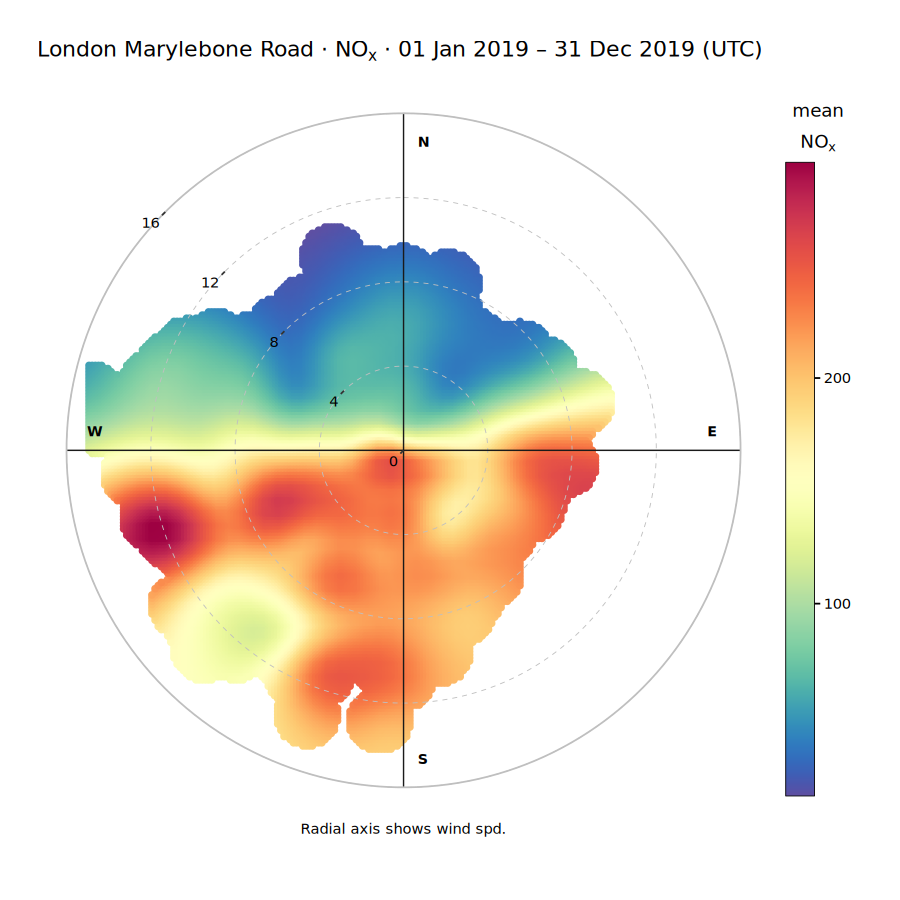

# Reproductions

Runnable scripts that reproduce a real, published openair analysis **through this kit's MCP pipeline** — no chat model needed, no cherry-picked output. Run the script yourself and compare against the source.

## Marylebone Road NOx polar plot

Reproduces the openair book's canonical worked example:

```r
library(openair)
polarPlot(mydata, pollutant = "nox")
```

— [The openair book, Polar plots chapter](https://openair-project.github.io/book/sections/directional-analysis/polar-plots.html), David Carslaw.

The book's own explanation: the plot "clearly shows highest NOx concentrations when the wind is from the south-west," which — since the monitor sits on the **south** side of the street — is "strong evidence of street canyon recirculation": the plume blows back over the monitor rather than away from it.

**What this script does differently:** the book's `mydata` is a bundled historical snapshot (Marylebone Road / AURN site `MY1`, 1998–2005, with wind already merged in from an unspecified companion source). This script builds the same inputs live instead:

| Input | Source |
|-------|--------|
| NOx | `import_aurn` (site `MY1`) — real AURN roadside record |
| Wind (ws/wd) | Open-Meteo ERA5 archive, at MY1's coordinates (`import_meta` confirms 51.5225, -0.1546) — **MY1 itself does not report wind**; verified live (`import_aurn` for MY1 returns `co, nox, no2, no, o3, so2, pm10, pm2.5` only, no `ws`/`wd`) |

Pairing a pollutant source with an external wind source is exactly what this kit's [`multi-mcp`](../skills/multi-mcp/SKILL.md) pattern is for — this script does the same merge, just with a direct Open-Meteo call instead of a second MCP server.

### Run it

```bash
export OPENAIR_MCP_TOKEN=...
python reproductions/reproduce_marylebone_polarplot.py [YEAR]
```

`YEAR` defaults to 2019 (last complete pre-pandemic year — 2020/2021 traffic volumes don't represent the "normal" pattern the book describes). Needs `httpx` (already a harness dependency — see `tests/`).

### Reference output (2019, verified)



Same pattern as the book: highest NOx (red) sits in the **south/south-west** quadrant, lowest (blue) to the north — the 2019 live-imported data reproduces the same street-canyon signature the book describes from 1998–2005 data, twenty-plus years and a different data source apart.

**Not identical to the book's own figure** — different years, different wind source — the claim is the same *pattern*, from the same *site*, via the same *method*, not a pixel-identical plot.

## Adding another reproduction

1. Pick a real, citable, public source (a paper, the openair book, official documentation) — not an internal claim.
2. Verify the method against the primary source before writing code — site codes, function calls, expected pattern.
3. Script it the same way as `reproduce_marylebone_polarplot.py`: call the MCP tools directly (see `tests/mcp_remote.py` for the client), no chat model in the loop.
4. Run it live, actually look at the output, and only then document the comparison.
5. Commit one reference PNG under `reference/` plus a README section like this one.
